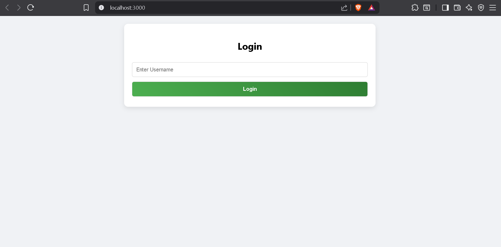
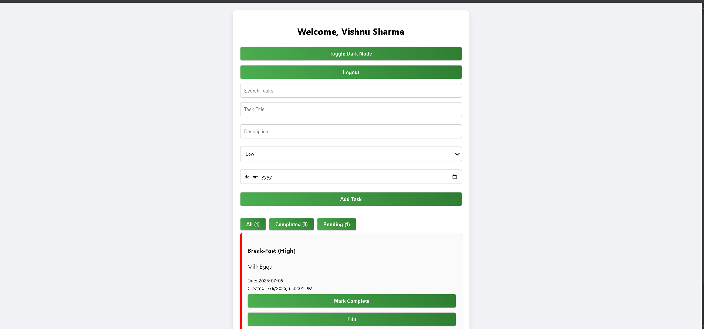

<<<<<<< HEAD
# Task Tracker React App

This is a simple task management system built with React. The project was coded according to the assignment instructions for simple task management with the use of localStorage.

## Features:
- Login with username (saved in browser localStorage)
- Add more tasks with:
- Title
- Description (optional)
- Priority selection (Low / Medium / High)
- Due date (optional)
- Mark tasks as Pending or Completed.
- Inline edit task titles
- Delete tasks
- Search field to filter tasks by name
- Actions can be grouped by All, Completed, or Pending.
- Isolation of tasks per user (tasks stored individually per user)
- Toggle Dark Mode full page
- Desktop and mobile responsive design
- Clean, minimalist modern looks using CSS

## Sample Screenshots:
### Login Page:


### Task Management:



## Guidelines for Running:
1. Extract the project folder.
2. Open the terminal/command prompt in the directory
3. Run:
```
npm install
npm start
```
The application is run on `http://localhost:3000`.

## Notes:
- This project utilizes only React and plain CSS (no third-party UI libraries)
Login credentials and activities are cached locally within the browser; no actual authentication has occurred.
Dark mode and task lists are saved until the browser's storage is cleared.
- Designed with user-friendly layout and mobile-friendly tweaks

## Optional Enhancements Added
- Full-page Dark Mode with responsiveness
- Private task storage (non-shared tasks between users)
- Smooth animations, hover effects, modern UI feel

## Assignment Compliance:

 Satisfies all fundamental assignment criteria.  Clean, easy-to-read code with realistic variable names and organization Appropriate for academic submission (original code, not plagiarized) --- Thanks for your consideration of this project.
=======
# task-tracker-react
 A simple personal task management application using React
>>>>>>> 84c004b096ff2ef2d81d44af37b552dbc07e04ad
